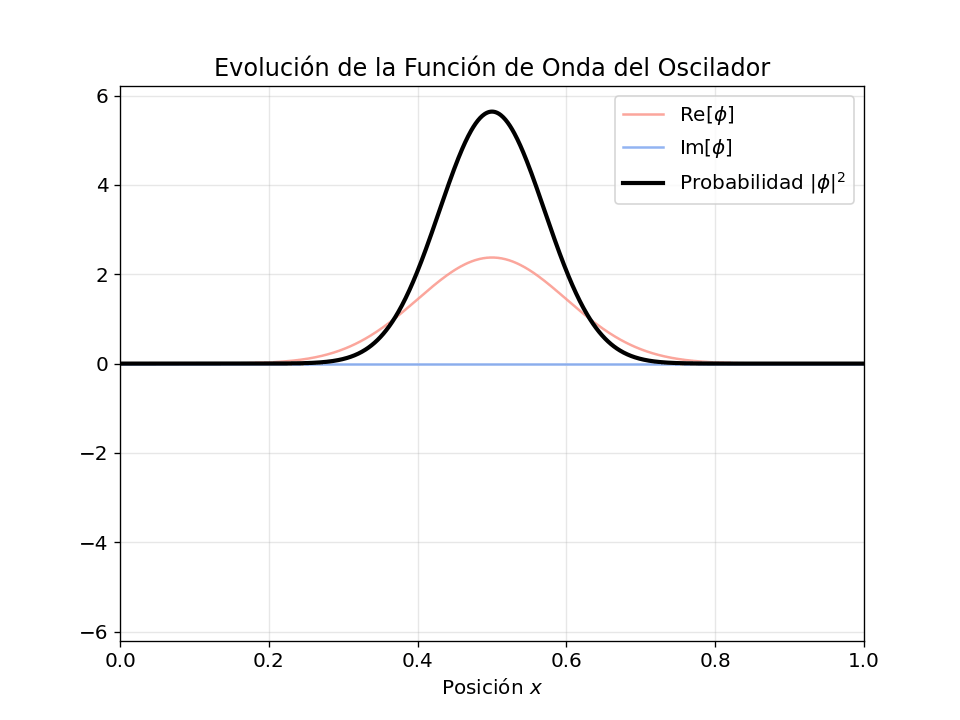
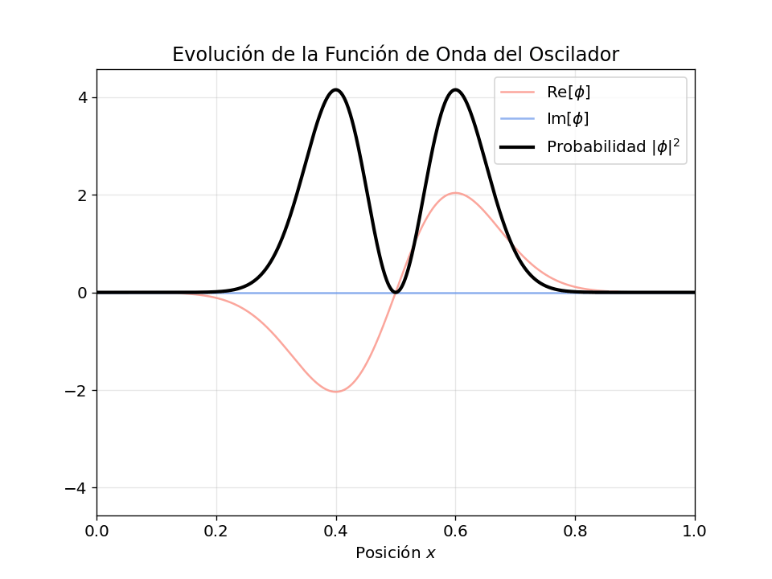
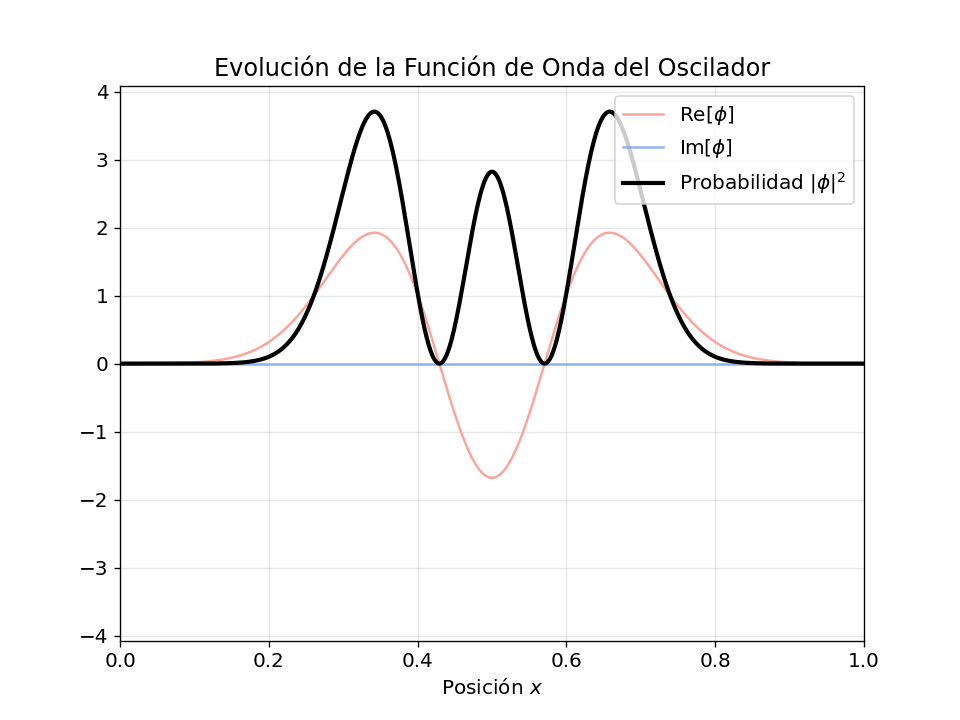
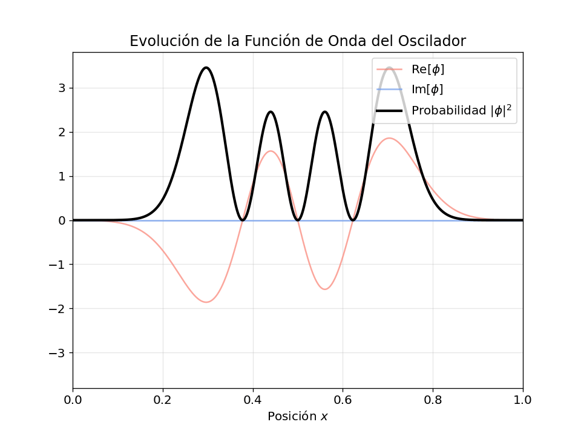
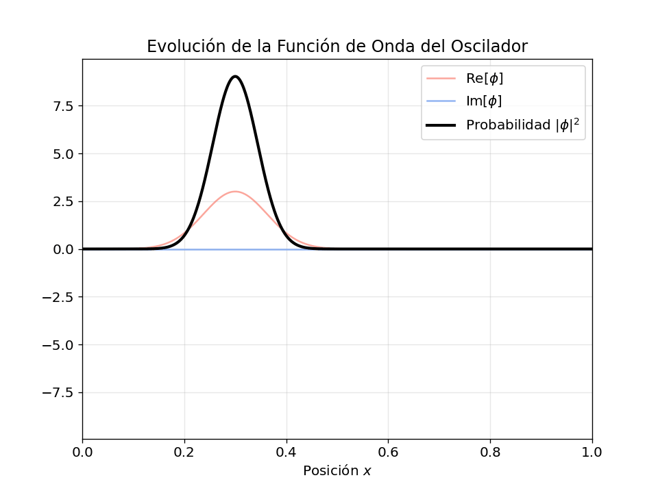
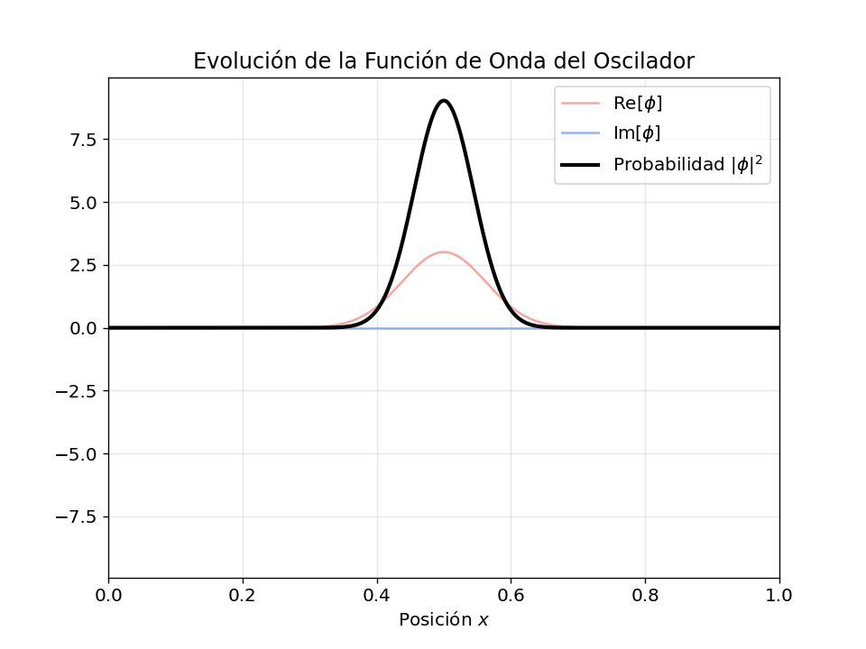

# Ecuacion-de-schrodiger
Contiene las animaciones de las funciones de onda referidas en el informe Voluntario 3, junto con el codigo necesario para reproducir todas las figuras contenidas en el informe 

# Animaciones
A continuación se muestran los resultados visuales de la práctica:

